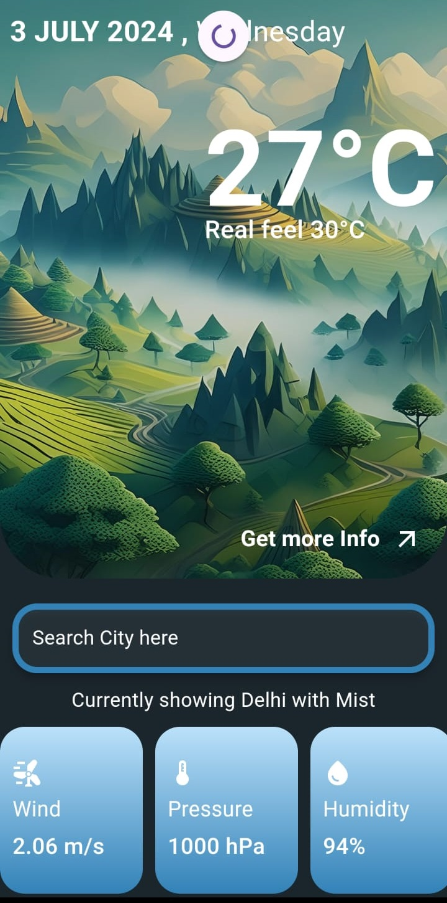
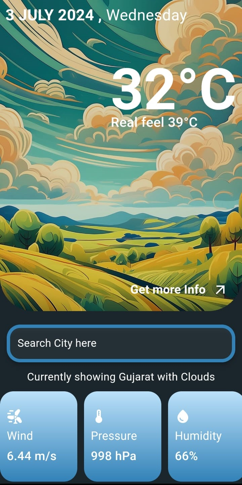

# Weather App

A simple weather app built with Flutter that displays current weather information for cities.

## Features

- Displays current temperature, real feel, wind speed, pressure, and humidity.
- Allows searching for weather information by city.
- Supports refreshing to update weather data.

## Technologies Used

- Flutter
- Dart
- OpenWeather API

## Screenshots

## Installation

1. Clone the repository: `git clone https://github.com/your-username/weather-app.git`
2. Navigate to the project directory.
3. Run `flutter pub get` to install dependencies.
4. Run the app on your preferred device or emulator using `flutter run`.
5. If just want to run the final build go to release and download the apk .

## Usage

- Enter a city name in the search bar to view current weather details.
- Swipe down on the screen to refresh weather data.
